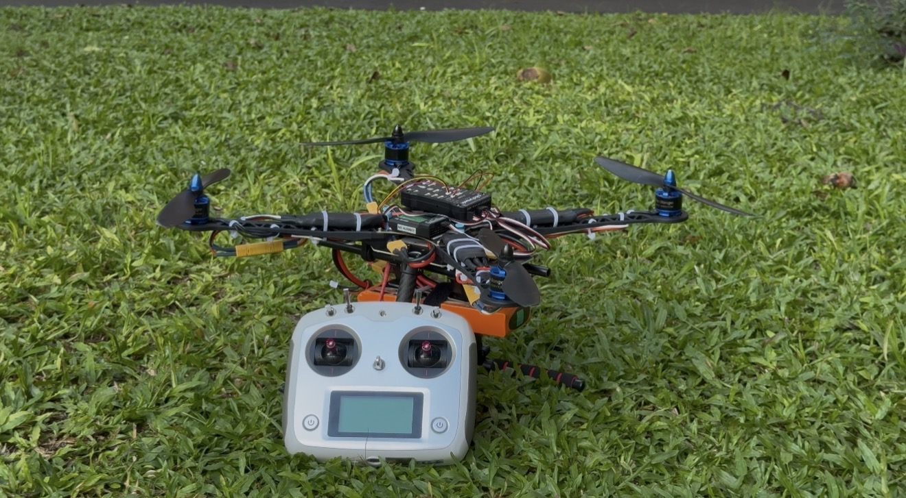

# Vision-Guided Autonomous Drone System for Aerial Crowd Monitoring and Adaptive Navigation

## Overview
This project aims to develop an autonomous drone capable of real-time crowd monitoring using AI and computer vision. The system detects people, avoids obstacles, and navigates safely in dynamic environments.
## Project Prototype

### Drone Prototype

### Hardware Setup

## Features
- Real-time crowd detection using YOLOv8
- Autonomous navigation
- Obstacle avoidance
- ROS2-based communication
- Pixhawk flight controller integration
- Raspberry Pi companion computer

## Technologies
- Python
- ROS2
- OpenCV
- YOLOv8
- Raspberry Pi 4
- Pixhawk 6X
- ArduPilot
- MAVLink
- QGroundControl
- Ubuntu Linux

## Applications
- Public safety
- Disaster response
- Crowd monitoring
- Smart surveillance

## Status
🚧 Final Year B.Tech Project (Under Development)

## Author
Sai Madhukar K
B.Tech Robotics and Mechatronics Engineering
Christ University, Bengaluru
